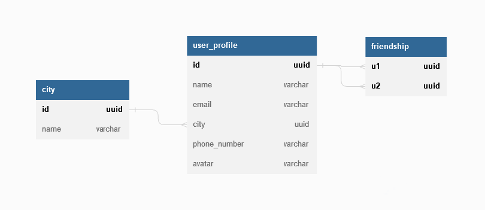
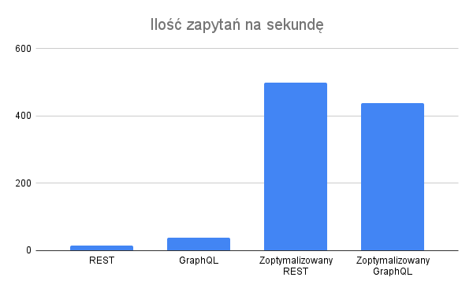
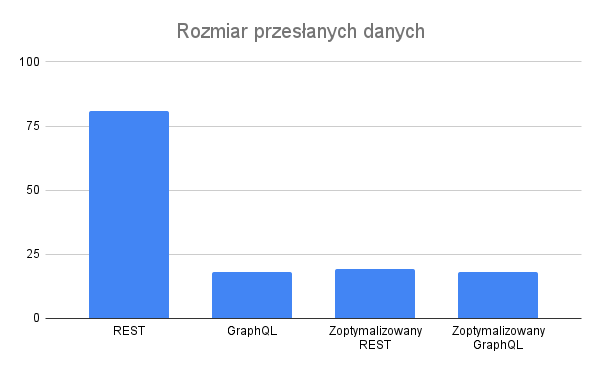

As part of my bachelor thesis I've made some REST/GraphQL benchmarks that I've thought some of you might find interesting. Let's start with short overview of both technologies.

# REST
Probably the most popular way of making API services right now. REST stands for `Representational state transfer` and APIs that follow REST rules are called "RESTful" APIs. In REST resource that you want to operate on is defined by some URI like `http://your.website/user/:id` and operation type is declared via HTTP method (get/post/put/delete). REST makes good use of HTTP protocol, it's easily cacheable so it's good choice for big websites and it's easy to implement. In my opinion REST get's messy once your services grows and it's easy to have poor performance with it if your API doesn't cover all edge cases that client's might need (bad API design can lead to waterfalls of requests).

# GraphQL
GraphQL was developed by Facebook when they were creating their mobile app. It's meant to solve a specific problem - fetching nested and related data. Turns out that most data in any application is relational so GraphQL can be used in any service, but even if somehow your data wasn't relational there are still benefits to GraphQL as it:
- is self documenting (easy to consume API for new people)
- can always fetch all necesary data in just one request
- has great tooling allowing for typed responses (less bugs)
- is easier to reason about
I'd like to spend some time on the last point. If you really think about it we really do thinkings about data in term of graphs is really natural and easy. `User` can have `Pet` that has `name` and `age`. It's easy to turn any data into tree of nodes and leaves. It's probably subjective but I've easier time making GraphQL services than REST ones. With GraphQL I don't need to think about the way my API is consumed, I just need to express all relations that node has and API consumer will pick stuff that he needs.

# Benchmark
The goal of this benchmark is comparing performance of both protocols in semi-real world scenario. We'll have two GraphQL servers, two REST servers, each kind of server has two implementations - naive and optimized. I've made two implementations as I've wanted to compare performance of thought out APIs and services that were quickly hacked together.

## Data structure
Here's our data structure.

Pretty simple, we have `user` table containing user information, each user belongs to some `city` and we also store `friendships` to be able to see information of every user friends. 

## Initialization
Benchmark starts with seedings database with random data. I'm generating 10 random cities, 1000 users and each user has 100 friends picked at random. This leaves us with ~90000 friendship relations (I'm lazy and ignored duplicate friendshipts so it's not 1000*100).

## Requested data
Requests for each implementations gather the following data (here presented in graphQL format):
```graphql
friends {
    id
    name
    city {
        name
    }
}
```
In other words "whats id, name and city of all my friends".
REST implementations have two variations, 
- naive: fetches user data using `/userFriends/:id` to get list of friends, followed by N requests to `/user/:id` and `/city:id` to get
- optimized: `/friendsCities/:userId` to get all required data in one HTTP request (two requests to database)

It's worth noting that both naive and optimized GraphQL implementations are used by user __THE SAME WAY__ (request at the beggining of this paragraph) so you can optimize backend without changing any frontend code. That would be much harder using REST.

GraphQL implementations are pretty simmilar, the only difference is that optimized implementation uses data loader to 


## Results
I've testes two metrics, requests per second that server can process and total responses size. Here are results.

### Request per second
Sorry for mixing lanugages, I'm using photo made for my bachelor which was written in my native language (polish). Anyway this graph contains information about request per second that each implementation was able to process.



Results:
- naive REST: 14.37 rq/s
- naive GraphQL: 39.26 rq/s
- optimized REST: 500.25 rq/s
- optimized GraphQL: 438.78 rq/s

So REST 'won', but at what cost. I've had to make inflexible endpoints made just for this specific purpose. I'm writing this article some time after making those benchmarks and coming back to see the benchmark code it was much less readable than Gql implementations. It's worth noting that Gql optimizations will be reused in other queries automatically. I've used dataloader to optimize any request that fetches friends data, so now if I'd want to get informations about friends of our friends I'd need another REST endpoint, but Gql will already perform nicely.

Naive implementation is more interesting to me. Gql achieved 2x performance without any effort. This benchmark was made in semi-real world scenario, so I'm using real database that servers fetch data from. I suspect that the reason for 2x performance is the fact that REST requests have waterfall effect. Without specialized endpoints client has to first fetch `userFriends` data before bombarding server with `user` requests to get every single `friend` infromation (it's called waterfall because you need to wait for one response before making another requests). GraphQL on the other hand has less communication between server and client and all traffic happens mainly between server and database. 

### Response size


Results:
- naive REST: 81MB
- naive GraphQL: 18.03MB
- optimized REST: 19.34MB
- optimized GraphQL: 18.23MB

As you can see even bad GraphQL implementation will have perfect score when it comes to response size. REST on the other hand suffers from overfetching that was solved in 'optimized' implementation, but it'll not carry on to other queries.


# Summary

GraphQL turned out to be really performant solution, that allows for very flexible access patterns which can perform well in any scenario. This benchmark didn't touch on other subjects like caching where REST would probably have the upper hand (there are GraphQL caching solutions too though).