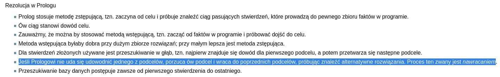

Krótka powtórka wiedzy wymaganej na obronie pracy licencjackiej na UMCS. Nie jest to wyczerpujące omówienie wszystkich problemów i osobiście polecałbym przeczytać cały ten post 1-2 razy, po czym poszukać materiałów bardziej szczegółowych do wybranych/cięższych tematów. Najzwyczajniej w świecie uznałem, że ucząc się zrobię krótkie podsumowanie każdego tematu tak, żeby mieć chociaż powierzchowne pojęcie na jego temat. Zebranie materiałów w jednym miejscu jest też dobre do utrwalania wiedzy. Proszę korzystać na własne ryzyko ( ͡° ͜ʖ ͡°) 


# Wektory i macierze – definicje i podstawowe operacje.

## Wektory
Obiekt matematyczny opisywany za pomocą modułu (wartość), kierunku oraz zwrotu. Wektor w przestrzeni 2d przyjmuje postać pary punktów - na przykład `[3, 4]`, co oznacza że aby stworzyć wektor w przestrzeni 2d należy ruszyć się o 3 punkty na osi X i 4 na osi Y.


### Dodawanie i odejmowanie
Aby dodać lub odjąć dwa wektory wystarczy odjąć od siebie analogiczne wartości. `[-10. 5]` + `[3, 2]` = `[-7, 7]`

### Mnożenie i dzielenie
Wektor można pomnożyć lub podzielić przez liczbę, co skutkuje zmianą obu wartości w wektorze. `[4,3] * 2 = [8,6]`

### Iloczyn skalarny
`[a1, b1] * [a2, b2] = a1 * a2 + b1 * b2`. Przykład: `[5,3] * [-1, 7] = 5*-1 + 3*7 = -5 + 21 = 16`

## Macierze 
Macierz to układ liczb, symboli lub wyrażeń zapisany w prostokątnej tablicy. Macierze wykorzystywane są przykładowo do rozwiązywania równań liniowych.


### Rozwiązywanie równań liniowych

# Funkcje skrótu i ich zastosowanie
Funkcja przyporządkowująca dowolnej wartości, wartość o stałej długości. Funkcje skrótu (inaczej hashujące) wykorzystywane są w kryptografii, do tworzenia struktur danych (hashmapy), do oceny integralności danych (caching - sumy kontrolne pozwalają porównać zbiory danych bez porównywania znak po znaku).

# Problemy rekurencyjne
Problemy rekurencyjne, to problemy które można rozwiązać korzystając z rekurencji, czyli można taki problem sprowadzić do postaci gdzie jego rozwiązanie zawiera w sobie swoją własną definicję. Przykładem może być ciąg Fibonacciego - `Fib(n) = Fib(n-1) + Fib(n-2)`. Każda funkcja wywołująca siebie samą jest rekurencyjna.
Inne problemy rekurencyjne to na przykład algorytmy typu dziel i rządź, gdzie zbiór danych jest dzielony, a następnie na obu połowach zbioru znowu wykonywany jest ten sam algorytm.

# Podstawowe charakterystyki statystyki opisowej i matematycznej

# Pozycyjne systemy liczbowe i konwersje pomiędzy nimi
Metoda zapisywania liczb, w której pozycja cyfry w ciągu oznacza wieloktorność potęgi bazy jaką dana cyfra reprezentuje. W systemie 10 liczba `121 = 1 * 10^2 + 2 * 10^1 + 1 * 1^0`. Potęgi bazy zaczynają się od 0 po prawej stronie i rosną o 1.
W innych systemach zmienia się wyłącznie wartość bazy. W systemie 5 liczba `434 = 4 * 5^2 + 3 * 5^1 + 4 * 5^0`. Zapisując liczbę w ten sposób można obliczyć jej wartość w systemie 10. Każdy system można więc łatwo zapisać w postaci dziesiętnej. 
Aby zamienić system 10 na inny system należy dzielić liczbę przez bazę danego systemu i zapisywać resztę z dzielenia. 173 w systemie 6 to
```
  173/6=28 reszta 5
  28/6=4   reszta 4
  4/6=0    reszta 4

  wynik w systemie szóstkowym = 445
```

# Sposoby cyfrowej reprezentacji liczby całkowitej i rzeczywistej

## Liczby całkowite
Liczba zapisywana jest w postaci binarnej. Typ liczby całkowitej (na przykład u8 - unsigned 8) oznacza ilość bitów wykorzystanych do reprezentacji liczby. Jeżeli liczba może być dodatnia lub ujemna należy wykorzystywać typ danych, w którym ostatni bit wykorzystywany jest do przechowywania informacji czy liczba jest dodatnia (jak i8).

## Ujemne liczby całkowite
W przypadku typów, w których liczba może być ujemna najstarszy bit jest wykorzystywany do informowania o tym czy liczba jest ujemna. Aby zapisać liczbę w postaci ujemnej zapisz jej bezwzględną wartość w postaci binarnej, następnie odwróć wszystkie bity i dodaj 1.
```
  -7 w systemie dziesiętnym
  1) zapisz jako 7 w systemie binarnym w zmiennej typu i8 (8 bitów)
  00000111
  2) odwróć bity
  11111000
  3) dodaj 1
  11111001
```

## Liczby dziesiętne
Norma IEEE 754 stanowi standard zapisywania liczb całkowitych przy użyciu 32 lub 64 bitów.
Pierwszy bit podobnie jak w przypadku liczb całkowitych zapisywany jest do kodowania ujemnych liczb (tzn jeśli ma wartość 1 to liczba jest ujemna). Dalej 8/11 bitów koduje wykładnik (nie może składać sie z samych zer lub jedynek), czyli potęgę do jakiej należy podnieść znormalizowaną wartość liczby. Reszta bitów wykorzystywana jest do zapisu liczby w znormalizowanym formacie binarnym. 

# Typ, zmienna, obiekt i zarządzanie pamięcią
## Typ
Typy danych niosą informacje na temat tego jak interpretowany powinien być dany wycinek pamięci. Ta sama sekwencja zer i jedynek może oznaczać różne rzeczy, zależnie od tego czy interpretowana jest jako liczba całkowita, zmiennoprzecinkowa lub znak tekstowy.
## Zmienna
Konstrukt programistyczny składający się z nazwy symbolicznej, miejsce przechowywania oraz wartość. 
## Obiekt
Konstukt złożony z jednego lub więcej typów prostych danych. Przykładem obiektu jest instancja klasy w c++.

# Instrukcje sterujące przepływem programu
Instrukcje sterujące zależą od wykorzystywanego języka, najczęstsze to:

- if
- switch
- for
- while
- do; while;
- match
- break
- continue
- goto

# Protokoły TCP i UDP – porównanie i zastosowanie
## TCP
Priorytetem TCP (Transmission Control Protocol) jest stabilność i niezawodność. TCP wymaga nawiązania połączenia przed przesłaniem właściwych pakietów. Dzięki temu możliwe jest na przykład ponowne przesłanie pakietów, jeżeli nie trafiły one do miejsca docelowego. Dodatkowe zadania związane z nawiązaniem i utrzymaniem tego połączenia zwiększają opóźnienie oraz przepustowość.
TCP jest stosowane wszędzie tam gdzie wymagana jest komunikacja z pewnością, że dane dotrą do celu, czyli w większości aplikacji internetowych, stronach internetowych.
## UDP
UDP (User Datagram Protocol) nie wymaga nawiązania wcześniejszego połączenia z klientem i od razu wysyła właściwe dane. Poza tym, że UDP nie wykonuje części czynności, nagłówki w tym protokole są również odpowiednio mniejsze (8 bajtów do 20-60 w TCP)
UDP wykorzystywane jest tam, gdzie potrzebne jest strumieniowanie danych w czasie rzeczywistym, korzystają z niego często gry komputerowe online.

Oba protokoły mają swój własny zestaw portów na komputerze, przykładowo jedna aplikacja może wykorzystywać port 420/tcp, inna 420/udp.


# Adresowanie w warstwie Internetu modelu TCP/IP
Pakiety wysyłane w sieci muszą zawierać adres IP oraz numer portu na który wysyłany jest dany pakiet. Adres składa się z 4 liczb 0-255 (np 192.168.1.1), a port ma numer od 0 do 65535. 
Publiczne adresy IP dzielą się na 3 klasy (A,B,C). Wartość pierwszego oktetu oznacza to do jakiej klasy należy (na przykład 0-127 należy do klasy A). Klasy te mają przyporządkowane domyślne maski sieci:
- A: 255.0.0.0
- B: 255.255.0.0
- C: 255.255.255.0

# Porównanie zadań przełącznika (switcha) i routera
- Switch wykorzystuje adresy MAC, Router adresy IP
- Switche obsługują tylko sieci przewodowe sieci LAN
- Router pracuje w wyższej warstwie sieci niż switch
- Switch przekazuje pakiety do nieznanych odbiorców wszystkich, router nie wysyła ich nigdzie

# Porównanie modelu OSI i TCP/IP
- model tcp/ip ma 4 warstwy, OSI 7
- warstwy TCP/IP to warstwa: aplikacji, transportu, internetowa, dostępu do sieci
- warstwy OSI to: aplikacji, prezentacji, sesji, transportowa, sieciowa, łącza danych, fizyczna
- warstwy OSI aplikacji, prezentacji oraz sesji odpowiadają jednej warstwie aplikacji modelu TCP/IP
- warstwa dostępu do sieci modelu TCP/IP zawiera w sobie dwie warstwy OSI: łącza danych oraz fizyczną 

# Mechanizm enkapsulacji w modelu OSI
Ruch sieciowy przekazywany jest do niższych warstw, gdzie pakiety są obudowywane w ramki wymagane przez daną warstwę. Przykładowo warstwa aplikacji przy obudowaniu w warstwę transportową zawiera ramki z wymaganymi adresami odbiorcy.

# Obiekt i klasa w wybranym języku programowania zorientowanym obiektowo
Javascript: 
```js
class Rect {
constructor(height, width) {
    this.height = height;
    this.width = width;
  }
  // Getter
  get area() {
    return this.calcArea();
  }
  // Method
  calcArea() {
    return this.height * this.width;
  }
  *getSides() {
    yield this.height;
    yield this.width;
    yield this.height;
    yield this.width;
  }
}

const square = new Rectangle(10, 10);
```
Co tu gadać, koń jaki jest każdy widzi. Klasa definiuje kształ obiektów danego typu, po czym obiekty tworzy się korzystając ze słowa `new`.

# Hermetyzacja, dziedziczenie i polimorfizm w programowaniu obiektowym.
## Hermetyzacja (enkapsulacja)
Ograniczanie dostępu do pól/metod zewnętrznym obiektom. Enkapsulacja pozwala na podejmowanie decyzji nt. tego jak konsumenci mają korzystać z danego API. Przykładem enkapsulacji jest stworzenie klasy, która ma 2 metody publiczne i więcej metod prywatnych. Prywatne metody mogą być wykorzystywane w definicjach publicznych metod, ale nie mogą być wywołane bezpośrednio przez użytkownika.
## Dziedziczenie
Dziedziczenie pozwala na rozbudowywanie klasy bazowej o nowe pola oraz metody. Szczegóły zależą od konkretnego języka. Z zasady klasy dziedziczące zawierają się w zbiorze klasy bazowej, mogą być więc używane polimorficznie.
## Polimorfizm
Możliwość wykorzystywania obiektów różnych typów w ten sam sposób. Przykładem mogą być klasy dziedziczące, które mogą być wykorzystywane w miejscu klasy bazowej. Innym przykładem polimorfizmu są interfejsy, które mogą być implementowane przez różne klasy. Jeśli obiekty różnych klas implementują ten sam interfejs, to mogą być wykorzystywane polimorficznie.

# Interfejsy i klasy abstrakcyjne w programowaniu obiektowym
Klasa abstrakcyjna, to klasa która nie może mieć żadnej instancji. Taka klasa dalej może mieć metody statyczne. Interfejsy to forma kontraktu w której często specyfikowana jest tylko sygnatura funkcji i zwracany typ danych.

# Paradygmat i przykłady programowania generycznego (rodzajowego)
Programowanie generyczne to rodzaj metaprogramowania, gdzie celem jest stworzenie generycznych metod, które mogą działać na różnych typach danych. Zależnie od języka umożliwiane jest to na różne sposoby. C++ wykorzystuje szablony, Java, C#, Typescript, Rust typy generyczne, a Zig (mniej znany język) Comptime (kod Zig, działający na etapie kompilacji, nie w runtime).

# Algorytmy sortowania
Algorytmy sortowania mają różną złożoność czasową i wymaganiami co do pamięci wymaganej do przeprowadzenia sortowania. Algorytmy typu bubble sort mają O(n^2), a quicksort oraz mergesort O(n log(n)). Jest nieskończenie wiele sposobów na posortowanie ciągu wartości, więc opiszę na szybko tylko dwa wydajne algorytmy - mergesort i quicksort.
Quicksort dzieli tablicę na dwie części, elementy mniejsze od wybranego pivota (elementu dzielącego tablicę) przerzuca na lewo, większe na prawo. Następnie na obu częściach wykonywany jest quicksort.
Mergesort dzieli tablicę na dwie części, a dopiero później łączy je w większe tablice. Różnice w praktyce jest taka, że mergesort najpierw rekursyjnie rozbija problem aż do samego dołu (aż do tablic o rozmiarze 1) i sortuje w trakcie łączenia, quicksort natomiast sortuje połówki tablic, aż cała tablica będzie posortowana.  

# Strategia „dziel i zwyciężaj” budowania algorytmów
Strategia ta dzieli problem na mniejsze problemy tego samego typu, rozwiązuje je rekursyjnie, po czym scala rozwiązania.
Przykłady: quicksort, mergesort, binary search

# Algorytmy typu zachłannego
Algorytm, który w każdym kroku dokonuje decyzji lokalnie optymalnej, czyli takiej która wydaje się najlepsza w danym kroku. Przykładem może być algorytm Dijkstry,   

# Algorytmy z nawrotami
Algorytmy, które tworzą drzewo rozwiązań. Jeśli nie spełniają określonego warunku lub trafią na sekwencję opracowaną w przeszłości wracają do innej ścieżki drzewa rozwiązań.

# Grafy, drzewa, kopce – charakterystyka i przykłady zastosowania
## Grafy
Graf to zbiór wierchołków (węzłów) oraz krawędzi. Krawędzie mogą być skierowane, czyli pozwalać na ruch tylko w jedną stronę np: A -> B - możesz z A przejść do B, ale nie odwrotnie. Krawędzie nieskierowane (A -- B) pozwalają na ruch w obie strony.

## Drzewa
Drzewo to specjalny rodzaj grafu, który zaczyna sie od jednego źródła (root), a każdy węzeł łączy się tylko ze swoim rodzicem i z 0 lub więcej dzieci.

## Kopce
Kopiec to drzewo, gdzie wartości dziecka są w stałej relacji z wartością rodzica. Inaczej, drzewo układa dane według pewnej hierarchii semantycznej, kopiec według wartości.

# Wielowarstwowa organizacja systemów komputerowych
Od najniższej:
- warstwa sprzętowa - wszystkie komponenty i peryferia PC
- system operacyjny - pozwala na kontakt między użytkownikiem a sprzętem
- oprogramowanie narzędziowe - sterowniki i programy potrzebne do funkcjonowania systemu
- oprogramowanie użytkowe - reszta programów
- użytkownik - człowiek lub inna maszyna konsumująca oprogramowanie

# System operacyjny – charakterystyka, zadania, klasyfikacja
System operacyjny zajmuje się:
- planowaniem i przydziałem zasobów
- synchronizacją i komunikacją procesów
- obsługuje warstwę sprzętową

Jest [wiele różnych](http://smurf.mimuw.edu.pl/node/871) klasyfikacji systemów operacyjnych: ze względu na liczbę wykonywanych programów, sposób przetwarzania itd. Szczerze to mało ciekawe klasyfikacje, które wydają mi się zbędną abstrakcją więc nie będę rozwijał tutaj tematu.

# Procesy i wątki – charakterystyka i problemy
Proces, to pewien program wykonywany w systemie, który dostał pulę zasobów do wykorzystania. W obrębie jednego procesu może znajdować się wiele wątków, które mogą być wykonywane równolegle lub na zmianę. Wątki są lżejsze od procesów i program może bez problemu stworzyć wiele tysięcy różnych wątków.

# Zarządzanie pamięcią operacyjną w systemie operacyjnym.
Programy korzystają z API systemu operacyjnego do alokowania i uwalniania potrzebnej pamięci. Przy wywołaniu odpowiedniego API system szuka wolnego miejsca. Szukanie wolnego miejsca może odbywać się korzystając z jednej z wielu różnych strategii (m.in. pierwsze wolne, najlepsze).

# Organizacja systemu plików i pamięci zewnętrznej.
Systemy plików NFTS/FAT32/EXT4?

# Różnice pomiędzy obsługą zdarzeń w przerwaniach sprzętowych a obsługą zdarzeń w pętli programowej.
Obsługiwanie zdarzeń w pętli programowej jest mało wydajne, ponieważ wymaga ciągłego sprawdzania bitów związanych z danymi wydarzeniami. System nie reaguje bezpośrednio na zdarzenie, tylko czeka aż program dojdzie do danego fragmentu kodu sprawdzającego stan flagi. Prowadzi to do większych opóźnień w reakcji na bodziec.
Metoda przerwań polega na tym, że to układy zgłaszają do jednostki centralnej potrzebę obsługi (w przeciwieństwie do pętli programowej gdzie system sprawdza stan układów). Gdy takie zdarzenie ma miejsce system przerywa aktualnie wykonywany kod i zaczyna obsługiwać dane wydarzenie.

# Powody i przykłady stosowania mikrokontrolerów zamiast typowych komputerów.
Powody:
- niższa cena
- mniej ruchomych części (tzn brak systemu, który może wprowadzać całą nową klasę błędów)
- mniejsze zużycie prądu

Przykłady:
- urządzenia RTV/AGD
- prosta elektronika

# Modele reprezentacji wiedzy.
[Źródło](http://staff.iiar.pwr.wroc.pl/dariusz.banasiak/si/SI_w5_notatki.pdf)

# Mechanizmy wnioskowań.
Wnioskowanie wstecz - wykazanie prawdziwości hipotezy na podstawie prawdziwości przesłanek.
Wnioskowanie wprzód - na podstawie prawdziwych faktów tworzone są nowe prawdziwe twierdzenia. Nowe twierdzenia mogę generować nowe wnioski. Proces jest powtarzany aż dojdzie się do zakładanej hipotezy lub aż skończą się nowe fakty.
Metoda rezolucji - dowodzenie przez zaprzeczenie.

# Metody uczenia maszynowego.
- Uczenie nadzorowane - uczenie następuje w wyniku porównania wyników programu z prawidłowymi odpowiedziami.
- Uczenie nienadzorowane - 
- Uczenie ze wzmocnieniem - uczenie następuje w wyniku reakcji na dane ze środowiska.

# Budowa sieci neuronowych.
Sieci neuronowe składają się z jednej lub więcej warstw neuronów, z których każdy ma pewien próg aktywacji. 

# Normalizacja baz danych – pierwsza, druga i trzecia postać normalna.
## Pierwsza postać normalna
- wiersz opisuje jeden obiekt
- wszystkie kolumny zawierają wartości elementarne/skalarne
- nie zawiera powtórzeń informacji na temat obiektu
- kolejność wierszy może być dowolna
## Druga postać normalna
- "Relacja jest w drugiej postaci normalnej wtedy i tylko wtedy, gdy jest w I postaci normalnej i żadna kolumna niekluczowa nie jest częściowo funkcyjnie zależna od jakiegokolwiek klucza potencjalnego" - nie pytaj
A tak serio: chodzi o to że tabela nie zawiera informacji, które możesz wywnioskować z klucza potencjalnego. Jeśli masz tabelę gdzie są imiona i płcie osób, to przy założeniu że imie jest przypisane do konkretnej płci, informacja o płci jest powtórzeniem danych - możesz ją wywnioskować z klucza potencjalnego (imienia), więc nie jest to druga postać normalna.
## Trzecia postać normalna
- "Relacja jest w trzeciej postaci normalnej wtedy i tylko wtedy, gdy jest w II postaci normalnej i żaden atrybut niekluczowy nie jest zależny funkcyjnie od innych atrybutów niekluczowych" - też nie pytaj
Znowu bardziej serio: żadna kolumna ma nie być do wywnioskowania z żadnej innej kolumny. Przechowujemy tylko informacje unikalne i jest git.

# Modele baz danych (logiczny, relacyjny, fizyczny).
[Źródło](https://dbadmin.net.pl/model-logiczny-baz-danych-jak-dziala-model-danych/)
## Logiczny
Model obiektów i relacji między danymi obiektami.
## Relacyjny
Dane pogrupowane są w relacje reprezentowane przez tabele. Osobiście rozumiem to jako model logiczny, tylko rozbity do postaci normalnej.
## Fizyczny
Implementacja modelu logicznego w komputerze. 

# Rodzaje zapytań w języku SQL.
SELECT, INSERT, DELETE, UPDATE - robią to co sugerują ich nazwy
# Funkcje w języku SQL.
Przykład funkcji SQL w Postgres
```sql
CREATE FUNCTION add(a integer, b integer) RETURNS integer
    LANGUAGE SQL
    IMMUTABLE
    RETURNS NULL ON NULL INPUT
    RETURN a + b;
```

# Transakcje w bazach danych.
Wiele operacji w bazach danych mogą być przeprowadzane w obrębie jednej transakcji. Jeśli na którymś kroku transakcja nie powiedzie się, to wszystkie wprowadzone wcześniej zmiany zostaną cofnięte. 

# Standardowe metodyki procesu wytwórczego oprogramowania.
- model kaskadowy - "Obejmuje on pięć głównych czynności, które wykonywane są tylko raz w procesie tworzenia: definiowanie i analizowanie wymagań, projektowanie oprogramowania, implementację i testowanie jednostek, integrację i testowanie systemu oraz wdrożenie
i pielęgnację."
- model ewolucyjny - stworzenie prototypu, danie go użytkownikowi i tworzenie nowych iteracji oprogramowania na podstawie zebranego feedbacku
- metody zwinne - metodyki zwinne mają dobrze funkcjonować w zmieniającym się środowisku (na przykład przy niezbyt dobrze zdefiniowanych wymaganiach dla projektu)

# Metodyki zwinne – SCRUM.
SCRUM, metodyka zwinna tworzenia oprogramowania oparta o koncepcję sprintów. Najpierw planowany jest sprint (zakres prac), następnie miejsce ma sprint (najdłuższy etap, bo robiona jest prawdziwa robota), w trakcie sprintu codziennie miejsce mają spotkania scrumowe gdzie każdy bardzo krótko mówi na jakim etapie prac jest i co zamierza zrobić w ciągu najbliższego czasu. Pod koniec sprintu miejsce ma jego przegląd, gdzie kontrolowane są postępy zrobione w trakcie sprintu i wyniki przedstawiane są interesariuszom. Ostatnim etapem jest retrospektywa, w trakcie której zespół może ocenić sprint i podzielić się wiedzą, która może sprawdzić, że kolejne sprinty przebiegną jeszcze sprawniej.

# Testowanie oprogramowania.
Testy automatyczne, manualne, CICD pipeline. Szeroki temat i ciężko powiedzieć co może interesować atakujących pracę :P W skrócie - testy automatyczne to testy, które kodujesz sam (na przykład przy użyciu frameworków e2e jak cypress/playwright), testy manualne są wtedy jak płacisz komuś z indii, żeby klikał w `buttona` i sprawdzał co się dzieje. CICD to rozwinięcie testów automatycznych, gdzie są one uruchamiane przy wrzuceniu kodu i w reakcji na wynik testów może następować aktualizacja aplikacji.

# Diagramy UML.
Jak ktoś lubi rysować zamiast programować to można.

# Wzorce projektowe programowania obiektowego.
[Źródło](https://www.oodesign.com/) - wzorców jest dużo, więc rzucę sam link. Najważniejsze to: singleton, strategia, fabryka, builder, obserwator, dekorator. Mimo wszystko warto kojarzyć więcej. 

# Definicja funkcji obliczalnej (częściowo rekurencyjnej).
"funkcja o argumentach i wartościach w zbiorze liczb naturalnych (lub w zbiorze tekstów), dla której można podać algorytm znajdujący wartość funkcji na podstawie danego argumentu".

Prościej - funkcja obliczalna to funkcja, którą może 'rozwiązać' maszyna turinga. Po co komplikują świrusy nie wiem.

Bonus: "Funkcja f (x1, . . . , xn) jest częściowo rekurencyjna, jeśli może być
otrzymana z funkcji prostych za pomocą skończonej liczby zastosowań
operacji złożenia, rekursji prostej oraz minimum efektywnego."

# Maszyna Turinga jako model procesów obliczalnych.
[dobre źródło](https://wazniak.mimuw.edu.pl/index.php?title=Z%C5%82o%C5%BCono%C5%9B%C4%87_obliczeniowa/Wyk%C5%82ad_1:_Obliczenia_w_modelu_maszyny_Turinga)
Maszyna turinga składa się z:
- nieskończonej taśmy z danymi wejściowymi (odpowiednik pamięci komputera). Może zawierać dowolne symbole, ale zwykle są to 0 i 1.
- głowica zapisująco odczytująca - może odczytywać i zapisywać symbole oraz poruszać się wzdłuż taśmy
- układ sterowania głowicą (odpowiednik procesora) - reaguje na dane odczytane przez głowicę i wysyła do niej kolejne polecenia

Maszyna Turinga jest w stanie rozwiązać wszystkie problemy obliczalne, jeśli więc udowodni się że jakiś problem nie może być rozwiązany przez maszynę turinga, nie należy on do kategorii problemów obliczalnych (nie mogą go rozwiązać nasze komputery).

# Zagadnienia nierostrzygalne w kontekście obliczalności.
Są zagadnienia, dla których udowodniono, że należą do grupy problemów nierozstrzygalnych: np. [problem stopu](https://www.codingninjas.com/studio/library/halting-problem-in-the-theory-of-computation).  

# Definicja i klasy złożoności obliczeniowej – czasowej i pamięciowej.
[źródło](https://wazniak.mimuw.edu.pl/index.php?title=Z%C5%82o%C5%BCono%C5%9B%C4%87_obliczeniowa/Wyk%C5%82ad_3:_Klasy_z%C5%82o%C5%BCono%C5%9Bci_obliczeniowej#Klasy_z.C5.82o.C5.BCono.C5.9Bci_czasowej_i_pami.C4.99ciowej)
W skrócie, klasy złożoności oznaczają zbiór języków spełniających wymagania stawiane przez daną maszynę turinga (SPACE, TIME, NSPACE, NTIME).

# Główne paradygmaty programowania – charakterystyka i przykłady.
- Obiektowe - program składa się z obiektów i ich wzajemnych oddziaływań. To one są centralnym elementem aplikacji.
- Funkcyjne - programowanie czerpiące z deklaratywnego paradygmatu programowania. Program powinien składać się z jak największej ilości deklaratywnych funkcji bez żadnych skutków ubocznych. 
- Imperatywne - mówisz maszynie jak ma coś zrobić (sumowanie tabelicy w pętli for)
- Deklaratywne - mówisz maszynie co ma zrobić dla ciebie (metoda .reduce() na tabeli)
I wiele innych, które często mają pokrywające się definicje i zahaczają o podobne koncepty nt. tego jak powinno być tworzone oprogramowanie.

# Gramatyki bezkontekstowe – definicje, charakterystyki i przykłady.
"Gramatyki bezkontekstowe są formalizmem służącym do opisu składni". Inaczej jest to sposób na uproszczenie różnych języków i zapisanie ich w tej samej notacji (BNF). Dzieki temu języki o różnych składniach mogą być sprowadzone do tego samego zapisu, co pozwala na używanie tych samych narzędzi do analizy różnych języków.

# Analiza leksykalna, syntaktyczna i semantyczna kodu.
## Analiza leksylana
Proces rozbijania programów na jednostki logiczne (takie jak instrukcje sterujące, identyfikatory lub konkretne dane).
Leks - ciąg znaków stanowiący semantycznie niepodzielną całość
Żeton - stała reprezentująca rodzaj wczytanego tokenu
Atrybut - opcjonalna wartość reprezentująca znaczenie tokenu
## Analiza syntaktyczna
Analizator syntaktyczny (parser) wykorzystuje efekt działania analizy leksykalnej (rozbite elementarne jednostki logiczne) i dokonuje analizy składniowej, w celu sprawdzenia czy dane mają właściwą strukturę.
## Analiza semantyczna
Analiza semantyczna służy upewnieniu się, że podany kod ma sens logiczny.

# Rodzaje błędów w kontekście analizy leksykalnej, syntaktycznej i semantycznej kodu.
## Analiza leksylana
- użycie niewłaściwych leksów (ciąg znaków lub operacji, które nie istnieją)
## Analiza syntaktyczna
- błędy 'składniowe', brak operacji między zmiennymi
## Analiza semantyczna
- błędy logiczne, przypisanie wartości niewłaściwego typu, użycie niewłaściwego typu danych, kontrola ilości i typów parametrów i argumentów funkcji oraz metod

# Deklaratywne programowanie funkcyjne: rachunek lambda, monady.
## Rachunek lambda
[źródło](http://logic.amu.edu.pl/images/2/22/Splawskilambda.pdf)
"jest teorią funkcji rozumianych konstruktywnie jako reguły obliczania, tj. przekształcania argumentu w wynik" 

## Monady
Monady to tylko monoidy z kategorii endofunktorów :P
[filmik](https://www.youtube.com/watch?v=N5HsN40YzfE)
Podsumowanie: monady to konstrukt posiadający funkcję unit (czyli opakowującą wartość w postać 'monady', taką jak konstruktor klasy) oraz funkcję bind (możliwość przeprowadzenia innej funkcji na argumencie przechowywanym przez monadę). Przykładem monady może być następujący kod.
```js
class Monad {
  // constructor to inaczej funkcja unit, która opakowuje 'x' w wrapper jakim jest tutaj klasa 'Monad'
  constructor(x: number){
    this.x = x;
  }
  // bind przyjmuje funkcję która zwraca nową Monadę
  bind(fn: (x)=>number): Monad {
    return new Monad(fn(this.x))
  }
}

let monadChain = new Monad(3)
let incremented = monadChain.bind(x => x+1)
let doubled = incremented.bind(x => x*2)
```
Nie sprawdzałem czy ten kod działa, ale przekazuje sens całego konceptu. 

# Deklaratywne programowanie w logice: klauzule Horne'a, nawracanie.
## Klauzule Horne'a
[źródło](https://pl.wikipedia.org/wiki/Klauzula_Horna)
## Nawracanie


# Podstawowe układy systemu mikroprocesorowego i sposób wymiany informacji pomiędzy nimi.
- mikroprocesor
- pamięć operacyjna RAM
- pamięć stała ROM
- układ wejścia wyjścia
- magistrale danych i adresowe


# Dekoder, multiplekser i demultiplekser: budowa, zasada, działania, przeznaczenie, zastosowanie.
[link](https://docplayer.pl/15999547-Multiplekser-dekoder-demultiplekser-koder.html)

# Kodowanie liczb ze znakiem w systemie U2, generowanie liczby ze znakiem przeciwnym, dodawanie i odejmowanie.
[link](https://eduinf.waw.pl/inf/alg/006_bin/0018.php)

# Budowa i zasada działania generatora obrazu w systemie mikroprocesorowym.
??


# Mechanizm sesji w zarządzaniu stanem aplikacji sieciowej.
- ciasteczka
- JWT


# Mechanizm gniazd – pojęcie, sposób realizacji i zastosowanie
[gniazda](https://edu.pjwstk.edu.pl/wyklady/mpr/scb/W8/W8.htm)


# Metody obsługi wielu klientów równolegle w aplikacjach sieciowych.
Zadania związane z obsługą ruchu w aplikacjach sieciowych zawsze mają duże opóźnienia związane z ciągłym czekaniem na odpowiedź. W zależności od wykorzystywanego języka można poradzić sobie z nimi na kilka sposobów.
1) tworzenie zielonych wątków (wiele języków wprowadza własną definicję wątków) do obsługi zapytania
2) wykorzystanie mechanizmów asynchronicznych (np pętla zdarzeń w JS lub async scheduler w RUST)

# Pocztowe protokoły warstwy aplikacji.
SMPT, POP, IMAP

# Porównanie HTTP i WebSocket.
HTTP służy do przesłania pakietu danych, websocket nawiązuje połącznie utrzymywane przez dłuższy okres czasu. Oba korzystają z TCP. WebSocket tworzy tunel i pozwala na przesyłanie wiadomości między dwoma komunikującymi się stronami, HTTP jest oparte o model ZAPYTANIE->ODPOWIEDŹ.

# Atrybuty bezpieczeństwa informacji.
- Integralność - informacja jest kompletna i nie została zmodyfikowana
- Dostępność - dostęp do informacji nie zostanie utracony, a informacja nie zostanie zniszczona
- Poufność - informacja nie zostanie udostępniona nieuprawnionym odbiorcom

# Modele dystrybucji kluczy kryptograficznych.
- model kurierski
- model elektroniczny

# Rodzaje zagrożeń oraz ochrona aplikacji sieciowych.
Zagrożenia:
- Ataki ddos
- SQL injection
- Przechwytywanie ruchu
- Man in the middle

Ochrona:
- SSL
- Walidacja wszystkich danych wprowadzanych przez użytkowników
- Szyfrowanie ruchu

# Charakterystyka kryptografii symetrycznej oraz asymetrycznej. 
- algorytmy symetryczne mają jeden klucz do szyfrowania i odszyfrowania informacji, asymetryczny ma dwa klucze: prywatny i publiczny
- w szyfrowaniu asymetrycznym klucz prywatny służy do szyfrowania informacji, publiczny do ich odszyfrowania
- szyfrowanie asymetryczne jest bezpieczniejsze, ponieważ ujawnienie klucza publicznego nie zmniejsza zaufania do informacji
